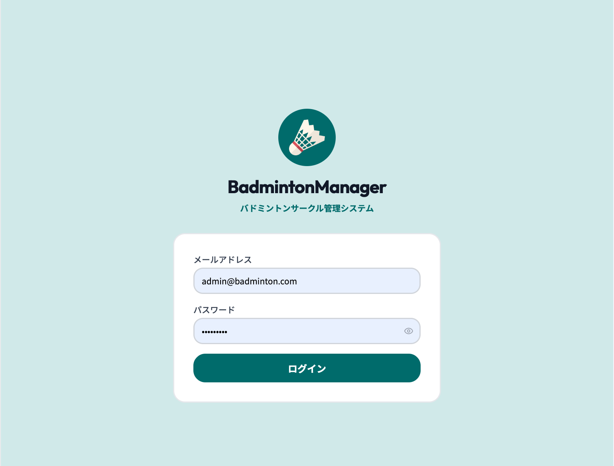
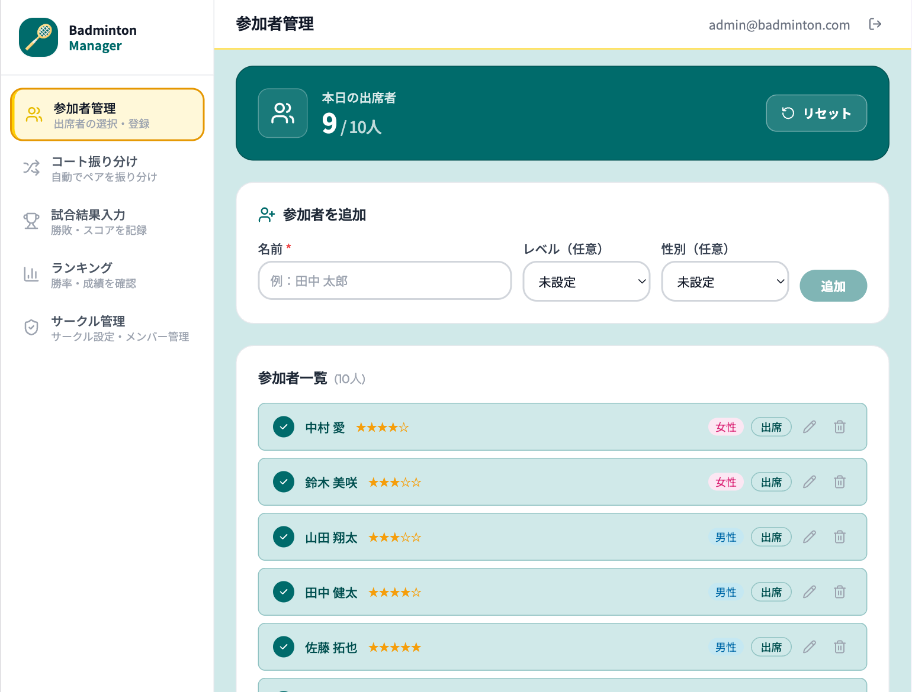
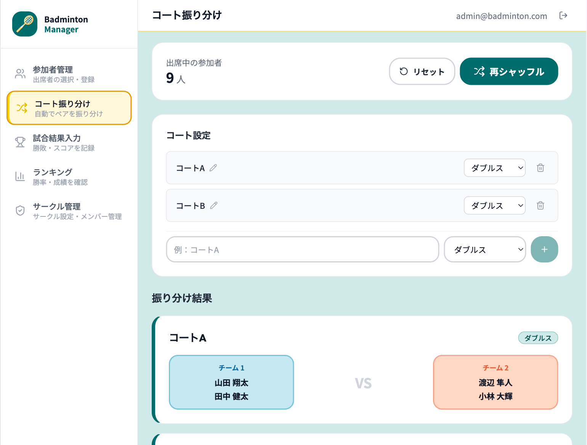
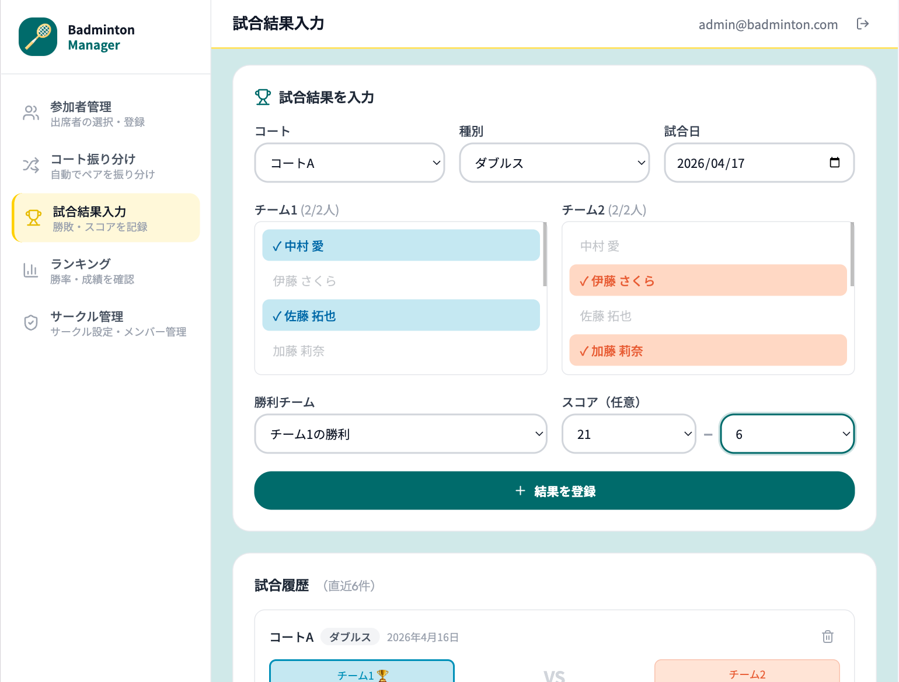
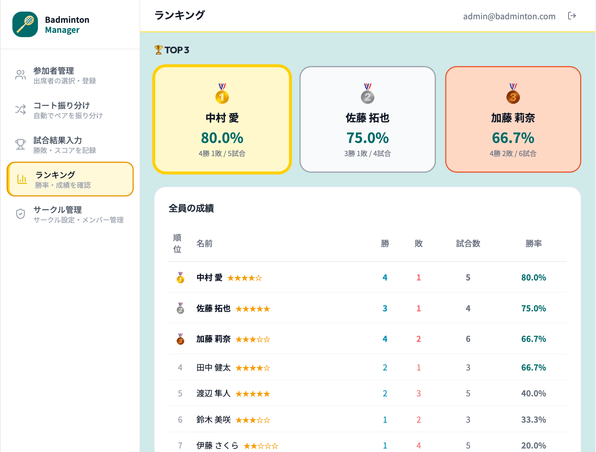
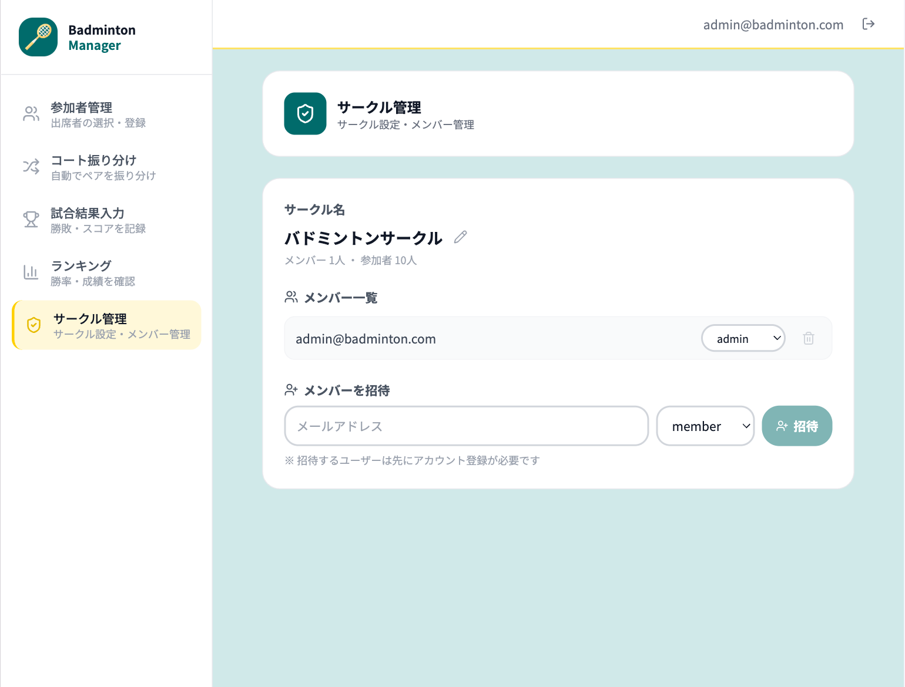

# 🏸 BadmintonManager

> バドミントンサークルの練習をもっとスマートに。
> コート振り分けと勝敗管理をひとつのアプリで完結させる。

## 👤 制作背景

自分がバドミントンサークルに所属しており、練習のたびに以下のような手作業が発生していました。

- 参加者の出席確認をその場でメモする
- コートの数・人数を見ながら手動でペアを決める
- 誰が何勝何敗かを覚えておくか、後で集計する

これらを毎回繰り返すのが煩わしく、「自分で作れるなら作ってしまおう」と考えたのがきっかけです。
実際の課題を解決するアプリを通じて、設計から実装・デプロイまでの一通りの開発経験を積むことを目的に制作しました。

---

## 🌐 デモ

**URL**: https://badminton-app-self.vercel.app

| 項目 | 内容 |
|------|------|
| Email | admin@badminton.com |
| Password | admin1234 |

---

## 📸 スクリーンショット

| ログイン | 参加者管理 | コート振り分け |
|---|---|---|
|  |  |  |

| 試合結果入力 | ランキング | サークル管理 |
|---|---|---|
|  |  |  |

---

## 📱 アプリ概要

バドミントンサークル・部活の管理者（幹事・部長など）向けの管理ツールです。
練習のたびにコートやペアを手作業で決める手間をなくし、出席者を選ぶだけで
自動でペアとコートに振り分けてくれます。

試合結果とスコアを記録すると、勝率・勝敗数をもとにしたランキングが自動で集計されます。
誰が強いのかひと目で分かり、練習のモチベーションアップにもつながります。

**マルチテナント対応** により複数のサークルを独立して管理できます。
各サークルのデータは完全に分離されており、Slack のワークスペースに近いイメージです。

---

## ✨ 主な機能

| 機能 | 説明 |
|------|------|
| 🔐 認証 | Supabase Auth によるセキュアなログイン |
| 🏢 マルチテナント | サークルごとにデータを完全分離。複数サークル所属にも対応 |
| 🛡️ RBAC | admin / member のロールで管理者機能へのアクセスを制御 |
| 👥 参加者管理 | 参加者の追加・編集・削除・当日の出席者選択 |
| 🎲 コート自動振り分け | 男女均等になるようランダムでペア・コートを割り当て |
| 🏆 試合結果入力 | 勝敗・スコアを記録・削除 |
| 📊 ランキング表示 | 3試合以上の参加者の勝率・勝敗数を集計して表示 |
| ⚙️ 管理者パネル | サークル名変更・メンバー招待・役割変更・削除 |

---

## 📖 用語について

| 用語 | 説明 |
|------|------|
| メンバー | アプリにログインできるアカウントを持つ人。`admin`（管理者）または `member`（一般）のロールを持つ |
| 参加者 | 練習に参加するプレイヤー。アカウントは不要で、管理者が登録・管理する |

> 例：幹事がアプリに副幹事を「メンバー」として招待し、練習に来るバドミントン部員を「参加者」として登録するイメージです。

---

## 🔐 認証フロー

```
ログイン
  ↓
サークルが0件 → /setup（初期設定・サークル作成）
サークルが1件 → 自動選択して /players へ
サークルが複数 → /select-circle（サークル選択画面）
未所属 → /no-circle（招待待ち案内）
```

---

## 🛠️ 技術スタック

| カテゴリ | 技術 |
|----------|------|
| フロントエンド | Next.js 16 (App Router) / React 19 / TypeScript |
| スタイリング | Tailwind CSS |
| バックエンド | Next.js API Routes / Server Actions |
| 認証 | Supabase Auth |
| データベース | PostgreSQL (Supabase) |
| ORM | Prisma |
| CI/CD | GitHub Actions |
| デプロイ | Vercel |

---

## 🏗️ システム構成

```
クライアント（ブラウザ）
    ↓ fetch / Server Actions
Next.js API Routes（/api/...）
    ↓ Prisma
PostgreSQL（Supabase）
    ↑
Supabase Auth（認証）
```

---

## 📁 ディレクトリ構成

```
src/
├── app/
│   ├── (main)/             # サークル選択済みユーザー向けの画面
│   │   ├── players/        # 参加者管理
│   │   ├── matching/       # コート振り分け
│   │   ├── result/         # 試合結果入力
│   │   └── ranking/        # ランキング
│   ├── admin/              # 管理者専用パネル（RBAC保護）
│   ├── setup/              # 初回セットアップ（サークル作成）
│   ├── select-circle/      # サークル選択
│   ├── no-circle/          # 未所属ガード
│   ├── auth/login/         # ログイン画面
│   └── api/                # REST API
├── components/
│   ├── ui/                 # 共通UIコンポーネント（Button, Badge など）
│   ├── players/            # 参加者関連
│   ├── matching/           # コート振り分け関連
│   ├── result/             # 試合結果関連
│   ├── ranking/            # ランキング関連
│   ├── admin/              # 管理者パネル関連
│   └── layout/             # サイドバー・ヘッダーなど
├── lib/
│   ├── circle.ts           # アクティブサークルのCookieヘルパー
│   ├── rbac.ts             # ロールベースアクセス制御
│   ├── api.ts              # APIレスポンスヘルパー
│   ├── prisma.ts           # Prismaクライアント
│   └── supabase/           # Supabaseクライアント（server / client / admin）
└── types/                  # TypeScript 型定義
```

---

## 💡 工夫した点

### キャッシュ制御（`force-dynamic`）

Next.js App Router はパフォーマンスのためにページをキャッシュしますが、参加者の出欠変更後に振り分けページへ遷移した際に古いデータが表示される可能性がありました。

`players` / `matching` / `result` / `ranking` の各ページに `export const dynamic = 'force-dynamic'` を追加し、常にサーバーから最新データを取得するように明示的に制御しています。

なお、これらのページは `cookies()` を使用しているため Next.js が自動的に動的レンダリングを行いますが、意図を明示しコードの可読性を高める目的でも記述しています。

### CI（GitHub Actions）

`main` / `develop` ブランチへの push・PR 時に以下を自動実行しています。

- ESLint による静的解析
- TypeScript の型チェック
- `next build` によるビルド確認

---

## 🌿 ブランチ戦略

```
main      ← 常にデプロイ可能
develop   ← 開発の統合ブランチ
feature/* ← 機能ごとの作業ブランチ
```

---

## 🚀 ローカル開発環境の起動

### 1. リポジトリをクローン

```bash
git clone https://github.com/YasunoriMizuno/badminton-app.git
cd badminton-app
```

### 2. パッケージをインストール

```bash
npm install
```

### 3. 環境変数を設定

`.env.example` を参考に `.env` を作成してください。

```env
NEXT_PUBLIC_SUPABASE_URL=
NEXT_PUBLIC_SUPABASE_ANON_KEY=
SUPABASE_SERVICE_ROLE_KEY=
DATABASE_URL=
DIRECT_URL=
```

### 4. DBマイグレーション

```bash
npx prisma migrate dev
```

### 5. 開発サーバー起動

```bash
npm run dev
```

→ http://localhost:3000 を開く

### 6. 初期セットアップ

1. Supabase でアカウントを作成してログイン
2. `/setup` でサークルを作成（自動的に admin として登録される）
3. 管理者パネル（`/admin`）からメンバーを招待できます
